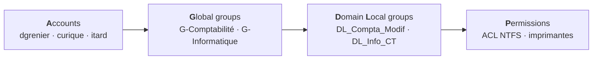
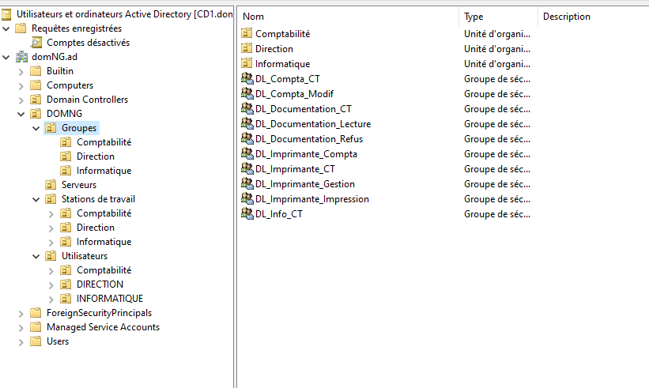
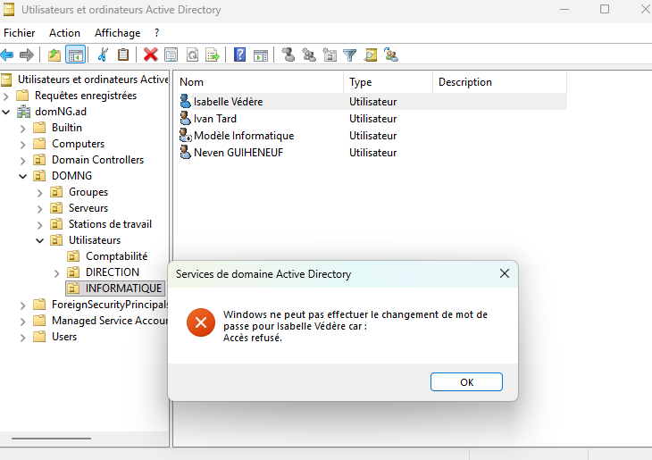
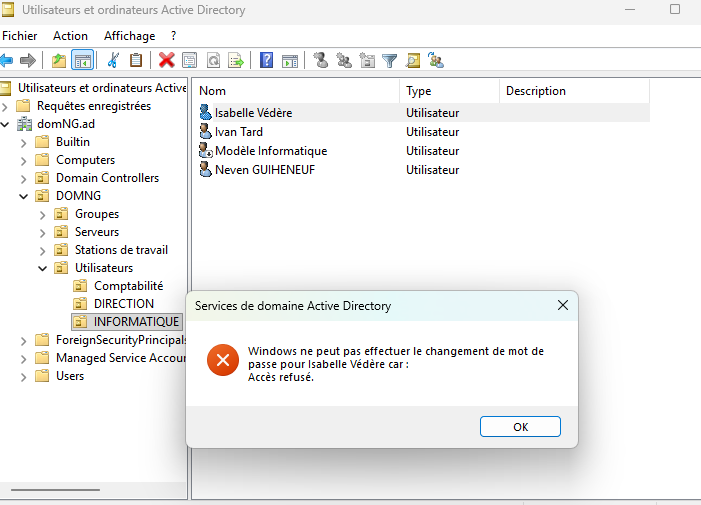
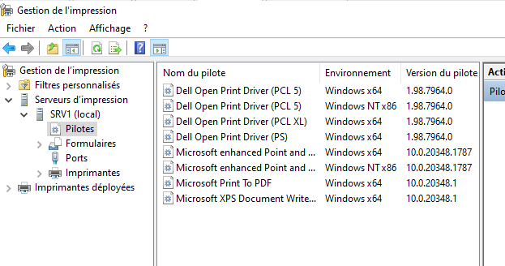
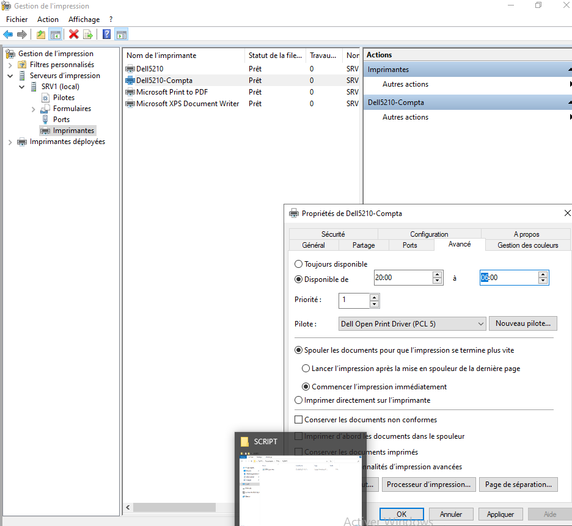
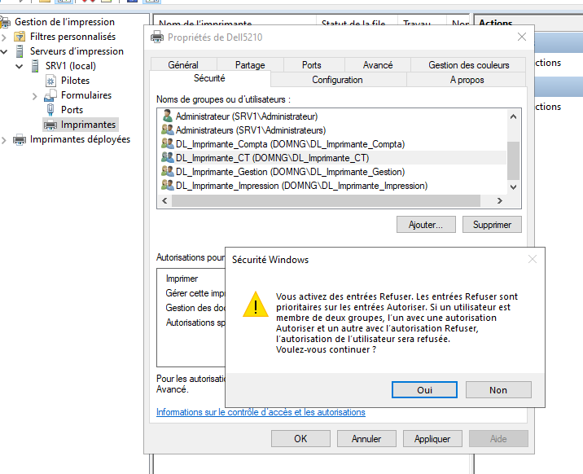
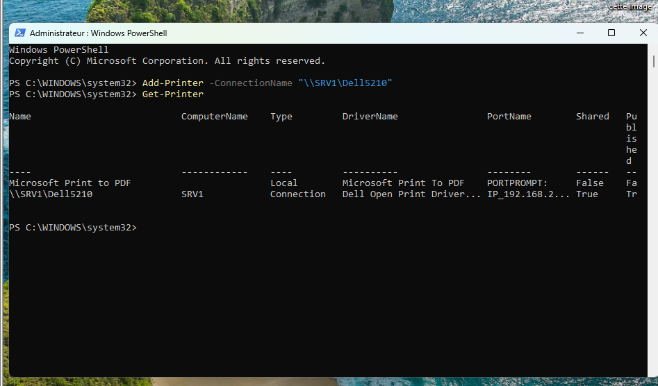
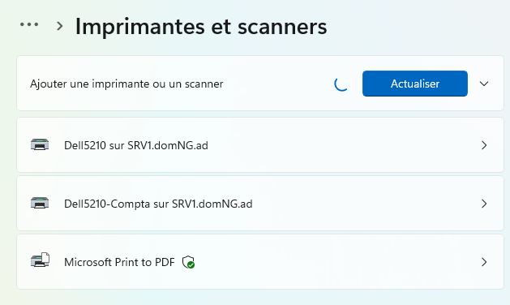

# Active Directory — Gestion de ressources

<p align="center">
  Pool de stockage tolérant à la panne, partages sécurisés en AGDLP,<br>
  délégation d'administration ciblée et serveur d'impression<br>
  sur un domaine Windows Server 2019.
</p>

<p align="center">
  
  
  
  
</p>

---

## Contexte et maquette

Domaine `domNG.ad`, deux contrôleurs de domaine, un serveur de fichiers et d'impression, un poste client.

| Machine | Rôle dans ce TP |
|---|---|
| **CD1** | Groupes de domaine locaux, délégation, publication du partage dans l'annuaire |
| **CD2** | Contrôleur supplémentaire (réplication) |
| **SRV1** | Pool de stockage, partages de fichiers, serveur d'impression |
| **W11-CL1** | Tests d'accès, tests de délégation, déploiement de l'imprimante |

**Utilisateurs et groupes globaux hérités du TP précédent** : `G-Direction`, `G-Informatique`, `G-Support technique`, `G-Comptabilité`, `G-Intérimaires`.

---

## La méthode AGDLP

C'est la structure d'attribution des droits recommandée par Microsoft. Elle évite de poser des permissions sur des comptes ou des groupes globaux, et rend les changements de droits triviaux.



!!! tip "Astuce"
    L'intérêt est concret : pour retirer un droit, on sort un groupe global du groupe DL. On ne touche **jamais** aux ACL des dossiers, qui restent stables dans le temps.

| Groupe de domaine local | Membre | Droit accordé |
|---|---|---|
| `DL_Documentation_Refus` | `G-Intérimaires` | **Refus** total |
| `DL_Documentation_Lecture` | Utilisateurs du domaine | Lecture |
| `DL_Documentation_CT` | `G-Informatique` | Contrôle total |
| `DL_Compta_Modif` | `G-Comptabilité` | Modification |
| `DL_Compta_CT` | `G-Informatique` | Contrôle total |
| `DL_Info_CT` | `G-Informatique` | Contrôle total |
| `DL_Imprimante_Impression` | Utilisateurs du domaine | Imprimer (journée) |
| `DL_Imprimante_Compta` | `G-Comptabilité` | Imprimer (20h – 6h) |
| `DL_Imprimante_Gestion` | David (`dgrenier`) | Gérer les documents |
| `DL_Imprimante_CT` | `G-Informatique` | Contrôle total |

---

## 1. Espaces disques et pool de stockage

Trois disques SCSI de 20 Go sont ajoutés à SRV1, puis regroupés dans un **pool de stockage**. Le disque virtuel est créé en **miroir** : chaque bloc est écrit sur deux disques, la perte d'un disque n'interrompt donc pas le service.

```powershell
# Les disques doivent rester vierges (RAW) pour être éligibles au pool
Get-PhysicalDisk -CanPool $true | ft FriendlyName,Size,BusType

New-StoragePool -FriendlyName "Pool-SRV1" -StorageSubSystemFriendlyName "Windows Storage*" `
                -PhysicalDisks (Get-PhysicalDisk -CanPool $true)

New-VirtualDisk -StoragePoolFriendlyName "Pool-SRV1" -FriendlyName "VD-Donnees" `
                -ResiliencySettingName Mirror -ProvisioningType Fixed -Size 16GB
```

| Volume | Taille | Système de fichiers | Accès |
|---|---|---|---|
| `DATA` | 10 Go | NTFS | `E:\` |
| `USERS` | 5 Go | NTFS | monté dans `C:\Base` (sans lettre) |

```powershell
$Disque = Get-VirtualDisk "VD-Donnees" | Get-Disk
Initialize-Disk -Number $Disque.Number -PartitionStyle GPT

New-Partition -DiskNumber $Disque.Number -Size 10GB -DriveLetter E |
    Format-Volume -FileSystem NTFS -NewFileSystemLabel "DATA" -Confirm:$false

New-Item -Path "C:\Base" -ItemType Directory
$Part = New-Partition -DiskNumber $Disque.Number -Size 5GB
$Part | Format-Volume -FileSystem NTFS -NewFileSystemLabel "USERS" -Confirm:$false
$Part | Add-PartitionAccessPath -AccessPath "C:\Base\"
```

!!! note
    L'état **Offline** des disques physiques n'est pas gênant : le pool les prend en charge directement, sans qu'ils soient montés dans Windows. Le miroir consomme 34,5 Go dans le pool pour 16 Go utiles, soit une efficacité de 50 %.

---

## 2. Groupes de domaine locaux

Dix groupes créés dans une OU dédiée `Groupes/Ressources`, puis alimentés par les groupes globaux.

```powershell
$OU = "OU=Ressources,OU=Groupes,OU=DOMNG,DC=domNG,DC=ad"

"DL_Documentation_Refus","DL_Documentation_Lecture","DL_Documentation_CT",
"DL_Compta_Modif","DL_Compta_CT","DL_Info_CT",
"DL_Imprimante_Impression","DL_Imprimante_Compta","DL_Imprimante_Gestion","DL_Imprimante_CT" |
    % { New-ADGroup -Name $_ -GroupScope DomainLocal -GroupCategory Security -Path $OU }

# "Utilisateurs du domaine" désigné par son SID (RID 513) : indépendant du nom français
$DomUsers = Get-ADGroup "$((Get-ADDomain).DomainSID)-513"

Add-ADGroupMember "DL_Documentation_Refus"   -Members "G-Intérimaires"
Add-ADGroupMember "DL_Documentation_Lecture" -Members $DomUsers
Add-ADGroupMember "DL_Documentation_CT"      -Members "G-Informatique"
Add-ADGroupMember "DL_Compta_Modif"          -Members "G-Comptabilité"
Add-ADGroupMember "DL_Compta_CT"             -Members "G-Informatique"
Add-ADGroupMember "DL_Info_CT"               -Members "G-Informatique"
```

<p align="center"></p>

---

## 3. Permissions NTFS et partages

**Principe retenu** : partage large, sécurité fine en NTFS. Lors d'un accès réseau, c'est le **plus restrictif** des deux jeux d'autorisations qui s'applique ; ne gérer qu'un seul niveau évite les erreurs et reste valable en accès local.

| Ressource | Partage | Autorisations NTFS |
|---|---|---|
| `E:\DATA\Documentation` | `Documentation` | Refus intérimaires · Lecture pour tous · CT Informatique |
| `E:\DATA\Services\Comptabilité` | `Compta` | Modification comptables · CT Informatique |
| `E:\DATA\Informatique` | `Info$` *(invisible)* | CT Informatique uniquement |

```powershell
# Documentation
icacls "E:\DATA\Documentation" /inheritance:r `
    /grant:r "*S-1-5-32-544:(OI)(CI)F" "*S-1-5-18:(OI)(CI)F" `
             "DOMNG\DL_Documentation_CT:(OI)(CI)F" "DOMNG\DL_Documentation_Lecture:(OI)(CI)RX"
icacls "E:\DATA\Documentation" /deny "DOMNG\DL_Documentation_Refus:(OI)(CI)F"

# Comptabilité
icacls "E:\DATA\Services\Comptabilité" /inheritance:r `
    /grant:r "*S-1-5-32-544:(OI)(CI)F" "*S-1-5-18:(OI)(CI)F" `
             "DOMNG\DL_Compta_CT:(OI)(CI)F" "DOMNG\DL_Compta_Modif:(OI)(CI)M"

# Informatique
icacls "E:\DATA\Informatique" /inheritance:r `
    /grant:r "*S-1-5-32-544:(OI)(CI)F" "*S-1-5-18:(OI)(CI)F" "DOMNG\DL_Info_CT:(OI)(CI)F"
```

<details>
<summary><b>Décoder la syntaxe icacls</b></summary>

| Élément | Signification |
|---|---|
| `/inheritance:r` | Supprime l'héritage, pour repartir d'une ACL maîtrisée |
| `(OI)` | *Object Inherit* — s'applique aux fichiers |
| `(CI)` | *Container Inherit* — s'applique aux sous-dossiers |
| `(IO)` | *Inherit Only* — ne s'applique pas au dossier lui-même |
| `F` / `M` / `RX` | Contrôle total / Modification / Lecture et exécution |
| `*S-1-5-32-544` | BUILTIN\Administrateurs, désigné par SID pour éviter les noms traduits |
| `*S-1-5-18` | SYSTEM |
| `*S-1-3-0` | CREATEUR PROPRIETAIRE |

</details>

!!! info "Important"
    Le **refus explicite** sur Documentation est indispensable : les intérimaires font partie des *Utilisateurs du domaine* et hériteraient sinon de la lecture. Un refus l'emporte toujours sur une autorisation.

```powershell
New-SmbShare -Name "Documentation" -Path "E:\DATA\Documentation"         -FullAccess "Tout le monde"
New-SmbShare -Name "Compta"        -Path "E:\DATA\Services\Comptabilité" -FullAccess "Tout le monde"
New-SmbShare -Name 'Info$'         -Path "E:\DATA\Informatique"          -FullAccess "Tout le monde"

# Publication du partage dans l'annuaire (sur CD1)
New-ADObject -Type volume -Name "Documentation" `
    -Path "OU=Serveurs,OU=DOMNG,DC=domNG,DC=ad" `
    -OtherAttributes @{uNCName="\\SRV1\Documentation"}
```

Le `$` final rend le partage `Info$` invisible dans le voisinage réseau : il reste accessible en saisissant directement `\\SRV1\Info$`.

---

## 4. Vérification des privilèges

Tests réalisés depuis le poste client, un compte à la fois.

```powershell
runas /user:DOMNG\<identifiant> cmd     # puis dir, type, echo test > ...
net use * /delete /y                    # entre deux comptes
```

!!! warning "Attention"
    Windows n'autorise qu'**une seule identité à la fois** vers un même serveur. Sans couper les sessions SMB, le test suivant s'exécute encore avec le compte précédent.

### Documentation

| Utilisateur | Privilège testé | Résultat | Explication |
|---|---|:---:|---|
| Christophe | Accès | ❌ ECHEC | Refus explicite (`G-Intérimaires`) |
| Christelle | Accès | ✅ OK | Utilisateurs du domaine → lecture |
| David | Lecture | ✅ OK | Utilisateurs du domaine → lecture |
| Isabelle | Lecture | ✅ OK | `G-Informatique` → contrôle total |
| Christelle | Modification | ❌ ECHEC | Lecture seule |
| Isabelle | Modification | ✅ OK | Contrôle total |

### Comptabilité

| Utilisateur | Privilège testé | Résultat | Explication |
|---|---|:---:|---|
| Christelle | Accès | ✅ OK | `DL_Compta_Modif` |
| David | Accès | ❌ ECHEC | Aucune ACE pour son service |
| Christelle | Modification | ✅ OK | `DL_Compta_Modif` |
| Isabelle | Contrôle total | ✅ OK | `DL_Compta_CT` |

---

## 5. Délégation de privilèges dans l'AD

La **délégation de contrôle** accorde des droits d'administration limités sur une branche de l'annuaire, sans donner de privilèges d'administrateur du domaine.

| Bénéficiaire | Portée | Droits |
|---|---|---|
| **David** | `Utilisateurs\Comptabilité` | Créer, supprimer, gérer les comptes · réinitialiser les mots de passe |
| **G-Support technique** | `Utilisateurs\Comptabilité` **et** `Utilisateurs\DIRECTION` | Idem |
| **Isabelle** | Forêt entière | Membre d'*Administrateurs de l'entreprise* |

```powershell
$Compta = "OU=Comptabilité,OU=Utilisateurs,OU=DOMNG,DC=domNG,DC=ad"
$Direct = "OU=DIRECTION,OU=Utilisateurs,OU=DOMNG,DC=domNG,DC=ad"

# /I:T = cet objet et les sous-objets · CCDC;user = créer/supprimer des comptes
# /I:S = sous-objets uniquement       · GA;;user  = contrôle total sur les comptes
dsacls $Compta /I:T /G "DOMNG\dgrenier:CCDC;user"
dsacls $Compta /I:S /G "DOMNG\dgrenier:GA;;user"

foreach ($OUSvc in $Compta, $Direct) {
    dsacls $OUSvc /I:T /G "DOMNG\G-Support technique:CCDC;user"
    dsacls $OUSvc /I:S /G "DOMNG\G-Support technique:GA;;user"
}

# Administrateurs de l'entreprise (RID 519), désigné par son SID
Add-ADGroupMember -Identity "$((Get-ADDomain).DomainSID)-519" -Members "ivedere"
```

!!! info "Important"
    La délégation est posée **OU par OU**. Appliquée sur l'OU *Utilisateurs*, elle engloberait le service Informatique, ce que l'énoncé interdit explicitement pour le support technique.

<table>
<tr>
<td width="50%"></td>
<td width="50%"></td>
</tr>
<tr>
<td align="center"><em>David : OK sur la Comptabilité, refusé sur INFORMATIQUE</em></td>
<td align="center"><em>Ivan : OK sur DIRECTION et Comptabilité, refusé sur INFORMATIQUE</em></td>
</tr>
</table>

Les tests s'effectuent en ouvrant la console sous une autre identité :

```powershell
runas /user:DOMNG\dgrenier "mmc C:\Windows\System32\dsa.msc"
runas /user:DOMNG\itard    "mmc C:\Windows\System32\dsa.msc"
```

---

## 6. Serveur d'impression

SRV1 devient serveur d'impression pour une Dell 5210CN en `192.168.21.30`.

```powershell
Install-WindowsFeature Print-Server -IncludeManagementTools

Expand-Archive "C:\Drivers_OPD_Dell_A16_Windows_x86_x64.zip" -DestinationPath "C:\Drivers"
pnputil /add-driver "C:\Drivers\Software_OPD_Dell_A16_Win\dellopd.inf"
Add-PrinterDriver -Name "Dell Open Print Driver (PCL 5)"

Add-PrinterPort -Name "IP_192.168.21.30" -PrinterHostAddress "192.168.21.30"
```

!!! tip "Astuce"
    Une imprimante logique ne peut pas appliquer d'horaires différents selon les groupes. La solution consiste à créer **deux imprimantes logiques sur le même port** : l'une pour la journée, l'autre réservée à la Comptabilité entre 20h et 6h.

```powershell
Add-Printer -Name "Dell5210"        -DriverName "Dell Open Print Driver (PCL 5)" `
            -PortName "IP_192.168.21.30" -Shared -ShareName "Dell5210"        -Published
Add-Printer -Name "Dell5210-Compta" -DriverName "Dell Open Print Driver (PCL 5)" `
            -PortName "IP_192.168.21.30" -Shared -ShareName "Dell5210-Compta" -Published
```

`-Published` référence l'imprimante dans l'annuaire, équivalent de la case *Répertorier dans l'annuaire*.

### Pilote 32 bits

Le fichier `dellopd.inf` contient les deux architectures, les binaires 32 bits étant dans le sous-dossier `i386`. L'ajout se fait dans **Gestion de l'impression › Pilotes › Ajouter un pilote**, en cochant x86.

<p align="center"></p>

### Horaires et autorisations

<table>
<tr>
<td width="50%"></td>
<td width="50%"></td>
</tr>
<tr>
<td align="center"><em>Dell5210-Compta : disponible de 20:00 à 06:00</em></td>
<td align="center"><em>Avertissement confirmant la prise en compte du refus</em></td>
</tr>
</table>

| Imprimante | Groupe | Autorisation |
|---|---|---|
| `Dell5210` | `DL_Imprimante_Impression` | Imprimer |
| `Dell5210` | `DL_Imprimante_Compta` | **Refuser** Imprimer |
| `Dell5210` | `DL_Imprimante_Gestion` | Imprimer + Gérer les documents |
| `Dell5210` | `DL_Imprimante_CT` | Contrôle total |
| `Dell5210-Compta` | `DL_Imprimante_Compta` | Imprimer (20h – 6h) |
| `Dell5210-Compta` | `DL_Imprimante_Gestion` | Imprimer + Gérer les documents |
| `Dell5210-Compta` | `DL_Imprimante_CT` | Contrôle total |

### Déploiement sur le poste client

```powershell
Add-Printer -ConnectionName "\\SRV1\Dell5210"
Get-Printer | ft Name,ComputerName,Type,DriverName,PortName
```

<table>
<tr>
<td width="50%"></td>
<td width="50%"></td>
</tr>
<tr>
<td align="center"><em>Connexion en type <code>Connection</code> vers SRV1</em></td>
<td align="center"><em>Les deux imprimantes publiées, trouvées via l'annuaire</em></td>
</tr>
</table>

---

## Points de vigilance

| # | Point | Conséquence si oublié |
|:-:|---|---|
| 1 | Activer les comptes créés désactivés au TP précédent | Impossible de mener les tests d'accès |
| 2 | Fermer / rouvrir la session après un changement de groupe | Le jeton d'accès ne contient pas le nouveau groupe |
| 3 | `net use * /delete /y` entre deux comptes testés | Le test rejoue avec l'identité précédente |
| 4 | Refus explicite pour les intérimaires | Ils héritent de la lecture via Utilisateurs du domaine |
| 5 | Déléguer OU par OU | Le service Informatique serait inclus |
| 6 | Deux imprimantes logiques sur un même port | Impossible d'appliquer des horaires par groupe |
| 7 | Pilote x86 ajouté depuis la console | Les clients 32 bits ne peuvent pas s'installer l'imprimante |

---

## Scripts

| Script | Contenu |
|---|---|
| [01-CD1.ps1](scripts/01-CD1.ps1) | groupes DL, publication du partage, délégation |
| [02-SRV1.ps1](scripts/02-SRV1.ps1) | pool de stockage, NTFS, partages, impression |
| [03-W11CL1.ps1](scripts/03-W11CL1.ps1) | tests d'accès, de délégation et déploiement |

### Commandes de contrôle utiles

```powershell
Get-VirtualDisk | ft FriendlyName,ResiliencySettingName,Size,HealthStatus
icacls "E:\DATA\Documentation"
Get-ADGroup -Filter 'Name -like "DL_*"' | % { "$($_.Name) : " + ((Get-ADGroupMember $_).Name -join ", ") }
dsacls "OU=Comptabilité,OU=Utilisateurs,OU=DOMNG,DC=domNG,DC=ad"
Get-Printer | ft Name,ShareName,PortName,Published
```
