# Active Directory — Stratégies de groupe (GPO)

<p align="center">
  Mise en place d'un socle GPO complet sur un domaine Windows Server 2019 :<br>
  durcissement, restrictions ciblées, stratégie de mots de passe affinée,<br>
  déploiement d'imprimantes, redirection de dossiers et accès distant automatisé.
</p>

<p align="center">
  
  
  
  
</p>

---

## Contexte et maquette

Domaine `domNG.ad`, deux contrôleurs de domaine, un serveur membre et un poste client.

| Machine | Rôle | OU |
|---|---|---|
| **CD1** | Contrôleur de domaine, DNS | Domain Controllers |
| **CD2** | Contrôleur de domaine supplémentaire, PDC et RID | Domain Controllers |
| **SRV1** | Serveur de fichiers et serveur d'impression | `DOMNG/Serveurs` |
| **W11-CL1** | Poste client, RSAT installés | `DOMNG/Stations de travail/Informatique` |

```
domNG.ad
└── DOMNG
    ├── Utilisateurs          → Direction · Informatique · Comptabilité
    ├── Groupes               → Direction · Informatique · Comptabilité · Ressources
    ├── Stations de travail   → Direction · Informatique · Comptabilité
    └── Serveurs
```

---

## Rappels : comment fonctionne une GPO

Une GPO est un conteneur de paramètres stocké dans l'annuaire et dans `SYSVOL`, puis **lié** à un site, au domaine ou à une OU. Elle contient **deux moitiés indépendantes** :

| Moitié | Quand elle s'applique | Sur quelles OU |
|---|---|---|
| **Configuration ordinateur** | Au démarrage, puis toutes les ~90 min | OU contenant des objets **ordinateur** |
| **Configuration utilisateur** | À l'ouverture de session | OU contenant des objets **utilisateur** |

!!! tip
    Lier une GPO « utilisateur » à une OU de machines n'a **aucun effet**. C'est la première chose à vérifier quand un paramètre semble ignoré.

**Ordre d'application — LSDOU** : Local → Site → Domaine → OU parente → OU enfant.
La dernière appliquée l'emporte, sauf blocage d'héritage ou lien marqué *Appliqué* (Enforced).

**Deux techniques de filtrage**, toutes deux utilisées ici :

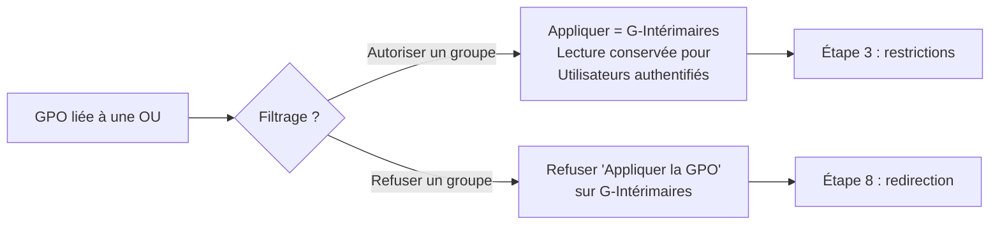

!!! info "Important"
    Depuis le correctif **MS16-072**, le traitement des GPO utilisateur se fait dans le contexte de l'ordinateur. Les *Utilisateurs authentifiés* doivent donc **toujours conserver le droit de lecture**, sous peine de voir la GPO ignorée par tout le monde.

---

## Vue d'ensemble des GPO

| GPO | Type | Liée à | Filtrage |
|---|:---:|---|---|
| `GPO-Ordi-Securite` | Ordinateur | Stations + Serveurs | — |
| `GPO-User-Direction` | Utilisateur | Utilisateurs\DIRECTION | — |
| `GPO-User-Interimaires` | Utilisateur | Utilisateurs | Appliquer : `G-Intérimaires` |
| `GPO-Imprimante-Direction` | Utilisateur | Utilisateurs\DIRECTION | — |
| `GPO-Imprimante-Informatique` | Utilisateur | Utilisateurs\INFORMATIQUE | — |
| `GPO-Imprimante-Comptabilite` | Utilisateur | Utilisateurs\Comptabilité | — |
| `GPO-Ordi-ReseauSupport` | Ordinateur | Stations de travail | — |
| `GPO-User-RedirectionDocs` | Utilisateur | Utilisateurs | Refus : `G-Intérimaires` |
| `GPO-Ordi-RDP-Serveurs` | Ordinateur | Serveurs | — |

Hors GPO : stratégie de mots de passe du domaine, PSO `PSO-Informatique`, magasin central dans SYSVOL.

---

## 1. Durcissement de tous les postes

**Objectif** — masquer le dernier identifiant connecté et forcer le pare-feu en blocage entrant.

Les deux demandes sont des paramètres **ordinateur** : la GPO est liée aux OU *Stations de travail* et *Serveurs*.

```powershell
New-GPO -Name "GPO-Ordi-Securite" -Comment "Dernier utilisateur masqué + pare-feu entrant"
New-GPLink -Name "GPO-Ordi-Securite" -Target "OU=Stations de travail,OU=DOMNG,DC=domNG,DC=ad"
New-GPLink -Name "GPO-Ordi-Securite" -Target "OU=Serveurs,OU=DOMNG,DC=domNG,DC=ad"

# Ne pas afficher le dernier nom d'utilisateur
Set-GPRegistryValue -Name "GPO-Ordi-Securite" `
    -Key "HKLM\SOFTWARE\Microsoft\Windows\CurrentVersion\Policies\System" `
    -ValueName "DontDisplayLastUserName" -Type DWord -Value 1

# Pare-feu actif + blocage entrant sur les trois profils
foreach ($Profil in "DomainProfile","PrivateProfile","PublicProfile") {
    Set-GPRegistryValue -Name "GPO-Ordi-Securite" `
        -Key "HKLM\SOFTWARE\Policies\Microsoft\WindowsFirewall\$Profil" `
        -ValueName "EnableFirewall" -Type DWord -Value 1
    Set-GPRegistryValue -Name "GPO-Ordi-Securite" `
        -Key "HKLM\SOFTWARE\Policies\Microsoft\WindowsFirewall\$Profil" `
        -ValueName "DefaultInboundAction" -Type DWord -Value 1   # 1 = bloquer
}
```

!!! warning "Attention"
    `StandardProfile` est l'ancien nom du profil Privé, hérité de Windows XP. Le pare-feu actuel lit **`PrivateProfile`** : avec l'ancien nom, la valeur arrive bien dans le registre du client mais le profil reste désactivé.

**Vérification**

```powershell
Get-NetFirewallProfile -PolicyStore ActiveStore | ft Name,Enabled,DefaultInboundAction
# Domain / Private / Public  →  True / Block
```

<p align="center">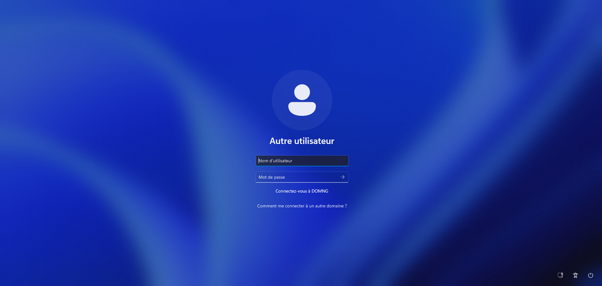</p>
<p align="center"><em>Aucun identifiant pré-rempli : « Autre utilisateur » avec les deux champs vides.</em></p>

---

## 2. Restrictions de la direction

Quatre restrictions en **configuration utilisateur**, sur une GPO liée à `Utilisateurs\DIRECTION`.

| Demande | Emplacement (Modèles d'administration) | Valeur |
|---|---|---|
| Propriétés du Poste de travail | Bureau | `NoPropertiesMyComputer = 1` |
| Console Certificats | Composants Windows › MMC | Composant **Désactivé** |
| Outils du registre | Système | `DisableRegistryTools = 1` |
| Gestionnaire des tâches | Système › Options Ctrl+Alt+Suppr | `DisableTaskMgr = 1` |

```powershell
Set-GPRegistryValue -Name "GPO-User-Direction" `
    -Key "HKCU\Software\Microsoft\Windows\CurrentVersion\Policies\Explorer" `
    -ValueName "NoPropertiesMyComputer" -Type DWord -Value 1
Set-GPRegistryValue -Name "GPO-User-Direction" `
    -Key "HKCU\Software\Microsoft\Windows\CurrentVersion\Policies\System" `
    -ValueName "DisableRegistryTools" -Type DWord -Value 1
Set-GPRegistryValue -Name "GPO-User-Direction" `
    -Key "HKCU\Software\Microsoft\Windows\CurrentVersion\Policies\System" `
    -ValueName "DisableTaskMgr" -Type DWord -Value 1
```

La console **Certificats** se pose en graphique, le paramètre reposant sur l'identifiant du composant enfichable. Logique inversée : **Désactivé = interdit**.

<p align="center">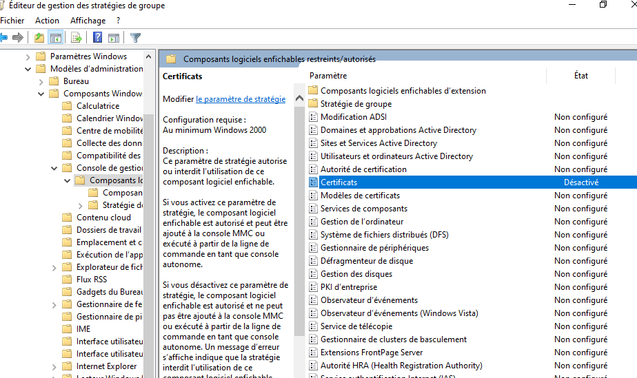</p>

---

## 3. Restrictions des intérimaires

Les intérimaires sont répartis dans plusieurs OU de service : la GPO est liée à l'OU *Utilisateurs* puis **filtrée** sur le groupe.

```powershell
# Seul G-Intérimaires applique...
Set-GPPermission -Name "GPO-User-Interimaires" -TargetName "G-Intérimaires" `
    -TargetType Group -PermissionLevel GpoApply
# ...les Utilisateurs authentifiés gardent la lecture (MS16-072)
Set-GPPermission -Name "GPO-User-Interimaires" -TargetName "Utilisateurs authentifiés" `
    -TargetType Group -PermissionLevel GpoRead -Replace

# Corbeille masquée
Set-GPRegistryValue -Name "GPO-User-Interimaires" `
    -Key "HKCU\Software\Microsoft\Windows\CurrentVersion\Policies\NonEnum" `
    -ValueName "{645FF040-5081-101B-9F08-00AA002F954E}" -Type DWord -Value 1

# CD/DVD interdits
$CD = "HKCU\Software\Policies\Microsoft\Windows\RemovableStorageDevices\" +
      "{53f56308-b6bf-11d0-94f2-00a0c91efb8b}"
Set-GPRegistryValue -Name "GPO-User-Interimaires" -Key $CD -ValueName "Deny_Read"  -Type DWord -Value 1
Set-GPRegistryValue -Name "GPO-User-Interimaires" -Key $CD -ValueName "Deny_Write" -Type DWord -Value 1
```

!!! note
    L'**animation de bienvenue** (`EnableFirstLogonAnimation`) est un paramètre **ordinateur** : impossible à filtrer sur un groupe d'utilisateurs sans activer le *traitement par bouclage* (loopback). Choix retenu ici : désactivation sur toutes les stations.

<table>
<tr>
<td width="50%">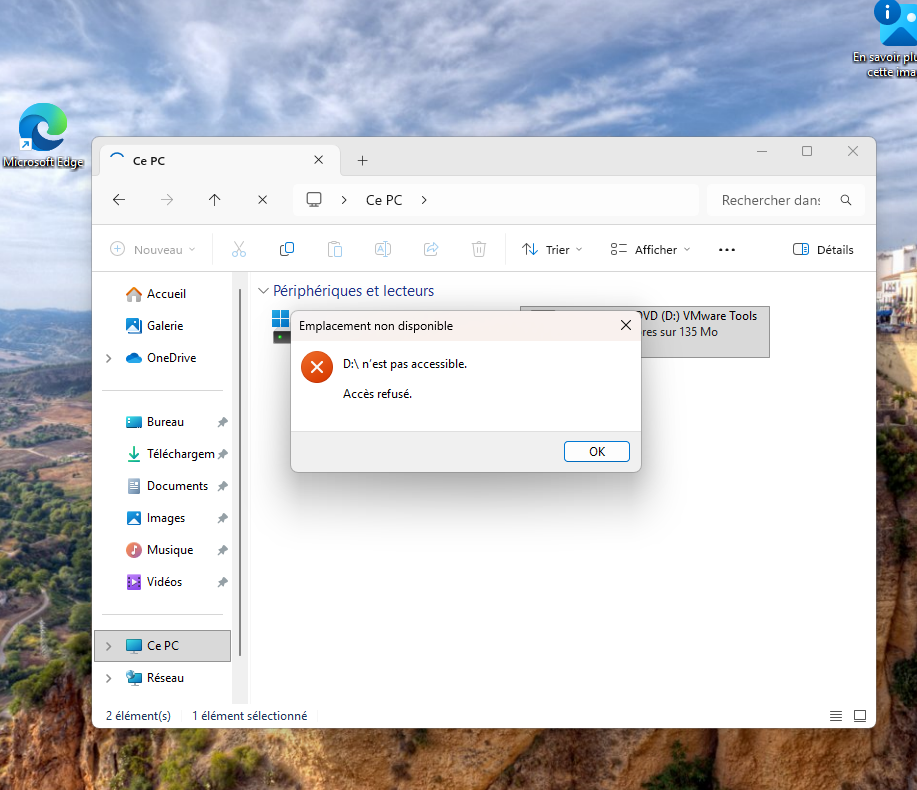</td>
<td width="50%">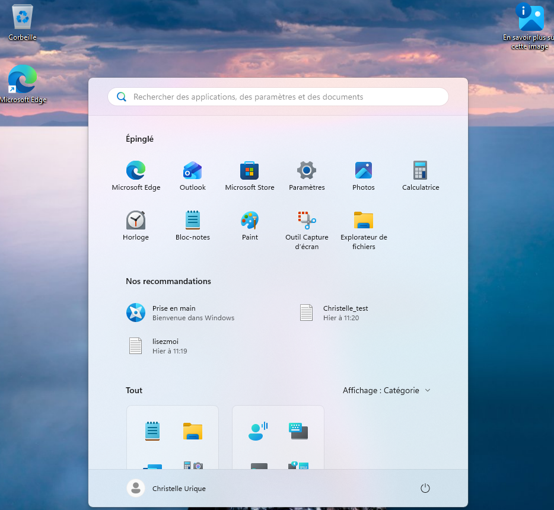</td>
</tr>
<tr>
<td align="center"><em>Intérimaire : pas de corbeille, lecteur D: refusé</em></td>
<td align="center"><em>Comptable : corbeille présente → filtrage effectif</em></td>
</tr>
</table>

---

## 4. Stratégie de mots de passe et PSO

Un domaine AD n'accepte qu'**une seule stratégie de comptes**, portée par la *Default Domain Policy*. Créer une seconde GPO de mots de passe et la lier à une OU n'a aucun effet sur les comptes du domaine.

Pour durcir un groupe précis, il faut une **stratégie affinée (PSO)**, stockée dans `CN=Password Settings Container`. En cas de PSO multiples, la plus petite `Precedence` gagne.

```powershell
# Domaine entier
Set-ADDefaultDomainPasswordPolicy -Identity "domNG.ad" `
    -MinPasswordLength 10 -ComplexityEnabled $true `
    -PasswordHistoryCount 20 -MaxPasswordAge "30.00:00:00"

# Service informatique
New-ADFineGrainedPasswordPolicy -Name "PSO-Informatique" -Precedence 10 `
    -MinPasswordLength 10 -ComplexityEnabled $true -PasswordHistoryCount 20 `
    -MaxPasswordAge "30.00:00:00" -LockoutThreshold 2 `
    -LockoutDuration "00:30:00" -LockoutObservationWindow "00:30:00"
Add-ADFineGrainedPasswordPolicySubject "PSO-Informatique" -Subjects "G-Informatique"

Get-ADUserResultantPasswordPolicy -Identity "ivedere"    # → PSO-Informatique
```

!!! danger "Piège"
    Deux contraintes font échouer la création :
    1. AD impose **`LockoutDuration >= LockoutObservationWindow`** — le couple *durée 0 / fenêtre 30 min* est rejeté par PowerShell (**erreur 8423**).
    2. Une **fenêtre d'observation à 0** remet le compteur d'échecs à zéro immédiatement : le seuil n'est **jamais** atteint et le compte ne se verrouille pas.

    Le Centre d'administration AD écrit les deux attributs en une seule opération et accepte « durée 0 = déverrouillage manuel » avec une fenêtre de 30 minutes.

<p align="center">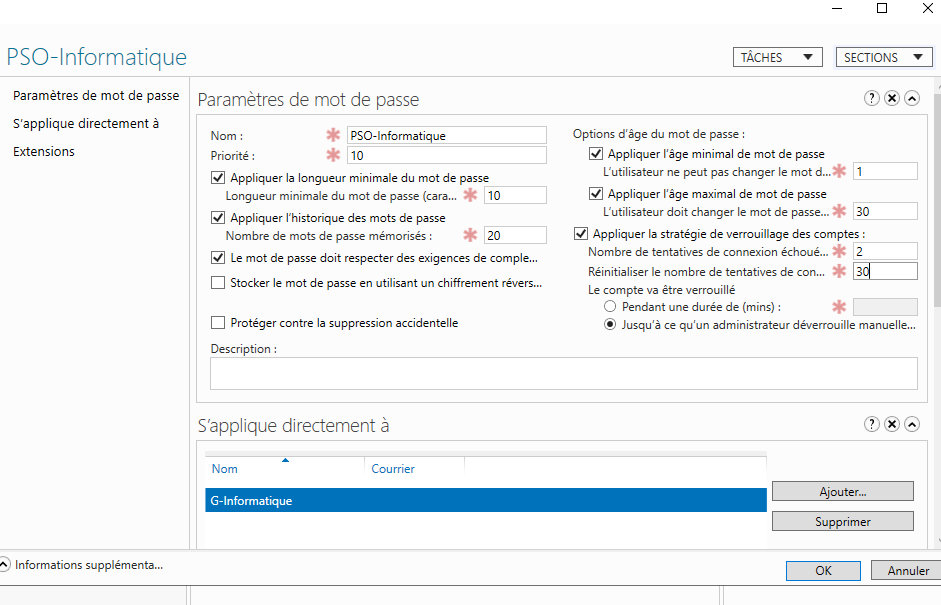</p>

**Test du verrouillage**

```powershell
# Depuis le client, deux échecs sur le MÊME contrôleur
net use \\CD1.domNG.ad\SYSVOL /user:DOMNG\itard Faux1
net use \\CD1.domNG.ad\SYSVOL /user:DOMNG\itard Faux2

# Depuis CD1
Search-ADAccount -LockedOut | ft Name,SamAccountName
Unlock-ADAccount itard
```

!!! warning "Attention"
    Le compteur `badPwdCount` **n'est pas répliqué** en temps réel : chaque DC tient le sien. Des échecs répartis entre CD1 et CD2 n'atteignent jamais le seuil. Le verrouillage, lui, est répliqué en urgence.

<p align="center"></p>

---

## 5. Déploiement des imprimantes

Déploiement **par utilisateur** : l'imprimante suit la personne quel que soit le poste.

```powershell
New-GPO -Name "GPO-Imprimante-Direction"    | New-GPLink -Target "OU=DIRECTION,OU=Utilisateurs,..."
New-GPO -Name "GPO-Imprimante-Informatique" | New-GPLink -Target "OU=INFORMATIQUE,OU=Utilisateurs,..."
New-GPO -Name "GPO-Imprimante-Comptabilite" | New-GPLink -Target "OU=Comptabilité,OU=Utilisateurs,..."
```

Puis, dans `printmanagement.msc` : clic droit sur l'imprimante › **Déployer avec une stratégie de groupe** › cocher *Les utilisateurs auxquels cette GPO s'applique*.

| Session | `Get-Printer` | GPO appliquée |
|---|---|---|
| David (Direction) | `\\SRV1.domNG.ad\Dell5210` | `GPO-Imprimante-Direction` |
| Christelle (Comptabilité) | `\\SRV1.domNG.ad\Dell5210-Compta` | `GPO-Imprimante-Comptabilite` |

<p align="center">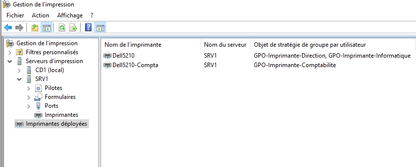</p>

!!! danger "Piège"
    Deux blocages sur cette étape :
    - le sélecteur de GPO reste **vide depuis SRV1** → piloter le serveur d'impression **depuis CD1** (`Install-WindowsFeature RSAT-Print-Services`) ;
    - l'extension *Deployed Printer Connections* échoue à cause de **PrintNightmare**, un utilisateur standard ne pouvant plus installer de pilote.

```powershell
Set-GPRegistryValue -Name "GPO-Ordi-Securite" `
    -Key "HKLM\Software\Policies\Microsoft\Windows NT\Printers\PointAndPrint" `
    -ValueName "RestrictDriverInstallationToAdministrators" -Type DWord -Value 0
```

---

## 6. Magasin central des modèles d'administration

Les **ADMX** décrivent les paramètres visibles dans l'éditeur de GPO, les **ADML** leurs libellés traduits. Sans magasin central, chaque console lit les modèles locaux de *sa* machine : les paramètres disponibles varient donc selon le poste et sa version de Windows.

Copiés dans **SYSVOL**, répliqué sur tous les DC, les modèles deviennent communs à tout le domaine — y compris depuis le poste client via les RSAT. C'est aussi ainsi qu'on ajoute les modèles tiers (Chrome, Firefox, Office).

```powershell
$Central = "\\domNG.ad\SYSVOL\domNG.ad\Policies\PolicyDefinitions"
New-Item -Path $Central -ItemType Directory -Force
Copy-Item "C:\Windows\PolicyDefinitions\*.admx" $Central -Force
New-Item -Path "$Central\fr-FR" -ItemType Directory -Force
Copy-Item "C:\Windows\PolicyDefinitions\fr-FR\*.adml" "$Central\fr-FR" -Force
```

<p align="center">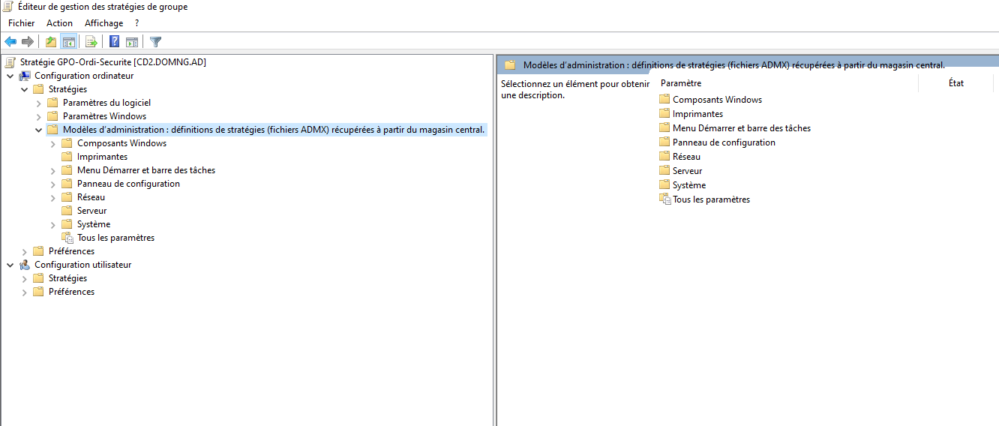</p>
<p align="center"><em>« définitions de stratégies (fichiers ADMX) récupérées à partir du magasin central »</em></p>

---

## 7. Délégation de la configuration réseau

Le groupe local intégré **Opérateurs de configuration réseau** (`S-1-5-32-556`) permet de modifier IP, DNS et cartes réseau **sans être administrateur** du poste.

| Méthode | Comportement | Retenue |
|---|---|:---:|
| Groupes restreints (Paramètres de sécurité) | **Remplace** la liste des membres | ✗ |
| Préférence *Utilisateurs et groupes locaux*, action **Mettre à jour** | **Ajoute** sans vider l'existant | ✓ |

<p align="center">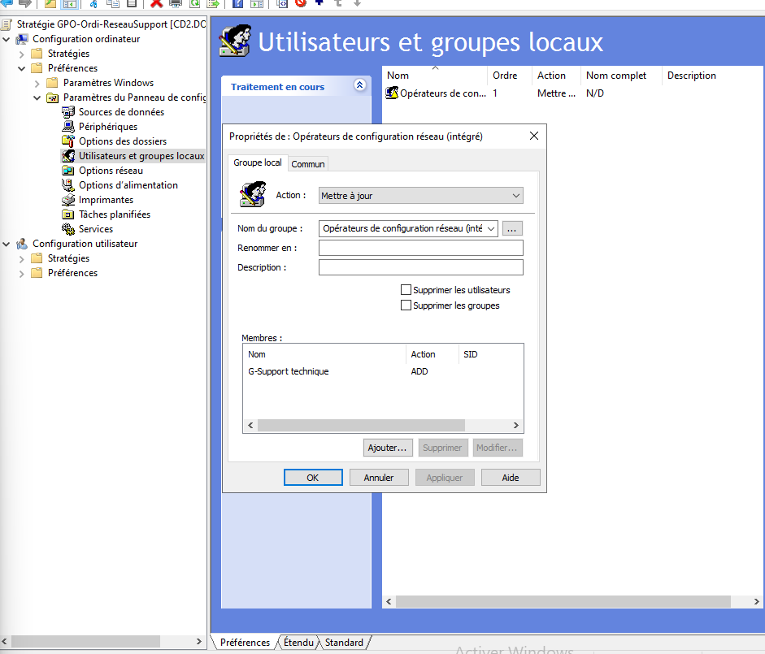</p>

```powershell
net localgroup "Opérateurs de configuration réseau"
# Membres : DOMNG\G-Support technique
```

!!! note
    Dans une console non élevée, `whoami /groups` affiche ce groupe comme « utilisé pour les refus uniquement » et `netsh` réclame une élévation. Ce n'est pas une absence de droit mais le **filtrage de jeton UAC**. La modification passe sans problème par l'application Paramètres.

---

## 8. Redirection du dossier Documents

Les profils étant locaux, une panne de disque fait perdre les données. Le dossier Documents est redirigé vers un partage de SRV1, sauvegardable de façon centralisée.

### Partage et sécurité (SRV1)

Chaque utilisateur doit pouvoir **créer** son dossier sans pouvoir **ouvrir** celui des autres. Il en devient propriétaire, donc obtient le contrôle total dessus via *CREATEUR PROPRIETAIRE*.

```powershell
New-SmbShare -Name 'Documents$' -Path "E:\DATA\Documents" -FullAccess "Utilisateurs authentifiés"

icacls "E:\DATA\Documents" /inheritance:r `
    /grant:r "*S-1-5-32-544:(OI)(CI)F" "*S-1-5-18:(OI)(CI)F" "*S-1-3-0:(OI)(CI)(IO)F" `
             "DOMNG\DL_Documents_Depot:(CI)(AD,RD)"
# *S-1-3-0 = CREATEUR PROPRIETAIRE (IO = sous-objets uniquement)
# AD = créer des dossiers · RD = lister le contenu
```

### Exclusion des intérimaires

Retirer l'autorisation ne suffit pas : ils restent membres des *Utilisateurs authentifiés*. Il faut un **refus explicite**, portant uniquement sur « Appliquer la stratégie de groupe ».

<table>
<tr>
<td width="50%">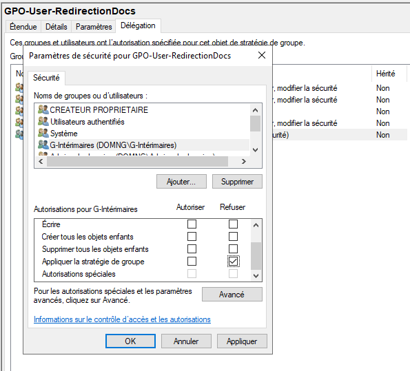</td>
<td width="50%">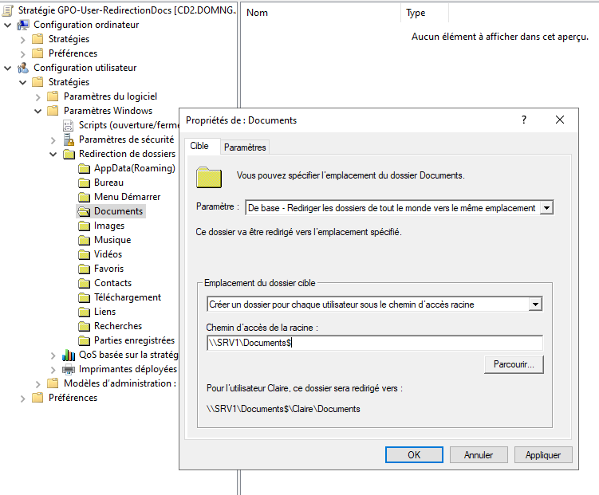</td>
</tr>
<tr>
<td align="center"><em>Refus ciblé sur « Appliquer la stratégie de groupe »</em></td>
<td align="center"><em>Un dossier par utilisateur sous <code>\\SRV1\Documents$</code></em></td>
</tr>
<tr>
<td>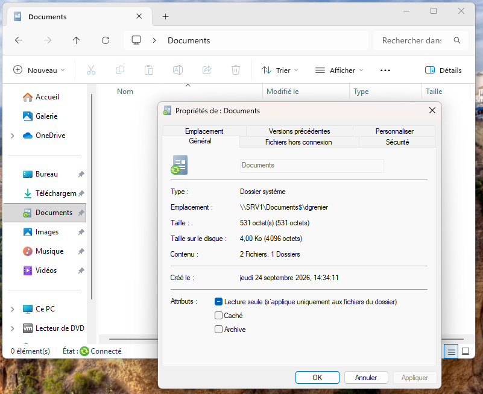</td>
<td>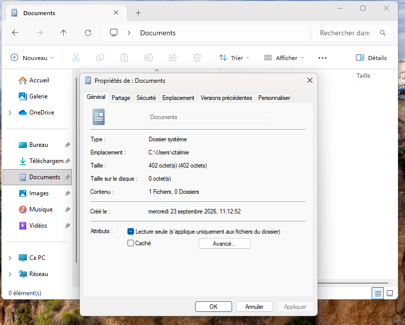</td>
</tr>
<tr>
<td align="center"><em>David → <code>\\SRV1\Documents$\dgrenier</code></em></td>
<td align="center"><em>Intérimaire → reste en <code>C:\Users\ctalmie</code></em></td>
</tr>
</table>

!!! note
    La redirection ne s'applique qu'à l'**ouverture de session**, Windows devant déplacer le dossier avant utilisation du profil. `gpupdate /force` propose donc de fermer la session : c'est normal.

---

## 9. Bureau à distance automatique

Tout nouveau serveur doit activer le RDP avec **NLA**, pour le seul support technique, sans intervention humaine.

**NLA** (*Network Level Authentication*) impose l'authentification **avant** l'ouverture de la session graphique : le serveur n'expose plus son écran de connexion à un client non authentifié.

```powershell
Set-GPRegistryValue -Name "GPO-Ordi-RDP-Serveurs" `
    -Key "HKLM\SOFTWARE\Policies\Microsoft\Windows NT\Terminal Services" `
    -ValueName "fDenyTSConnections" -Type DWord -Value 0   # connexions autorisées
Set-GPRegistryValue -Name "GPO-Ordi-RDP-Serveurs" `
    -Key "HKLM\SOFTWARE\Policies\Microsoft\Windows NT\Terminal Services" `
    -ValueName "UserAuthentication" -Type DWord -Value 1   # NLA exigé
```

Deux compléments en console : l'ouverture du **port 3389** (indispensable, l'étape 1 bloquant tout le trafic entrant) et l'ajout du groupe aux *Utilisateurs du Bureau à distance*.

<table>
<tr>
<td width="50%">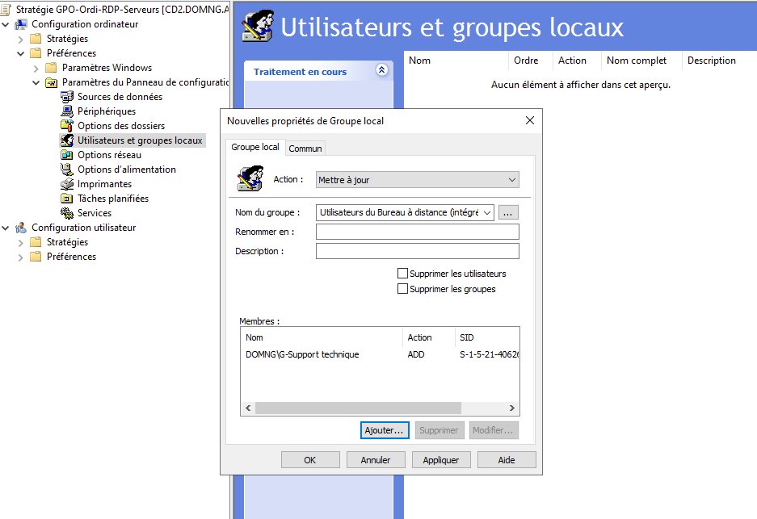</td>
<td width="50%">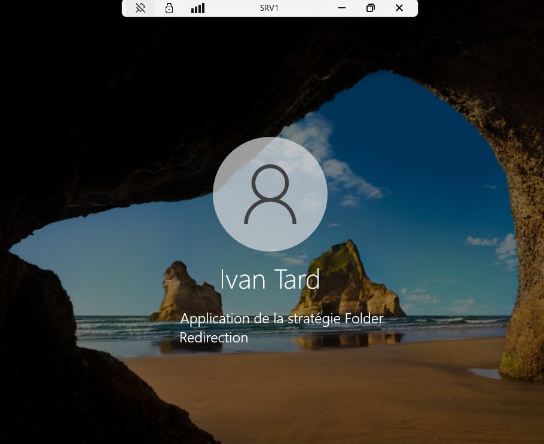</td>
</tr>
<tr>
<td align="center"><em>G-Support technique ajouté au groupe intégré</em></td>
<td align="center"><em>Connexion RDP réussie avec le compte d'Ivan</em></td>
</tr>
</table>

```powershell
# Test : RDP coupé manuellement, puis réactivé par la GPO
Set-ItemProperty "HKLM:\System\CurrentControlSet\Control\Terminal Server" -Name fDenyTSConnections -Value 1
gpupdate /force
Get-ItemProperty "HKLM:\SOFTWARE\Policies\Microsoft\Windows NT\Terminal Services" |
    fl fDenyTSConnections,UserAuthentication     # → 0 et 1
Restart-Service TermService -Force
```

!!! info "Important"
    Une machine qui rejoint le domaine atterrit dans **`CN=Computers`**, un conteneur sur lequel aucune GPO ne peut être liée. Pour une activation réellement automatique :

    ```powershell
    redircmp "OU=Serveurs,OU=DOMNG,DC=domNG,DC=ad"
    ```

---

## Pièges rencontrés

| # | Symptôme | Cause | Correction |
|:-:|---|---|---|
| 1 | Profil Privé du pare-feu toujours inactif | Clé `StandardProfile` obsolète | Utiliser `PrivateProfile` |
| 2 | `New-ADFineGrainedPasswordPolicy` → erreur 8423 | `LockoutDuration < LockoutObservationWindow` | Créer la PSO dans le Centre d'administration AD |
| 3 | Le compte ne se verrouille jamais | Fenêtre d'observation à 0 | Fenêtre à 30 minutes |
| 4 | Verrouillage aléatoire | `badPwdCount` non répliqué entre DC | Tester sur un seul contrôleur |
| 5 | Sélecteur de GPO vide dans Gestion de l'impression | Console lancée depuis SRV1 | Piloter depuis CD1 avec les RSAT |
| 6 | *Deployed Printer Connections* en échec | Restriction Point and Print (PrintNightmare) | `RestrictDriverInstallationToAdministrators = 0` |
| 7 | Privilège réseau « pour les refus uniquement » | Filtrage de jeton UAC | Comportement normal, passer par Paramètres |
| 8 | GPO ignorée après filtrage | Lecture retirée aux Utilisateurs authentifiés | Conserver `GpoRead` (MS16-072) |

---

## Scripts

| Script | Machine | Contenu |
|---|---|---|
| [01-CD1.ps1](scripts/01-CD1.ps1) | CD1 | GPO, PSO, magasin central, délégation |
| [02-SRV1.ps1](scripts/02-SRV1.ps1) | SRV1 | Partage des dossiers redirigés, impression, test RDP |
| [03-W11CL1.ps1](scripts/03-W11CL1.ps1) | W11-CL1 | Procédures et résultats des tests client |

### Méthode de test

| Type de paramètre | Prise en compte |
|---|---|
| Ordinateur | `gpupdate /force` puis **redémarrage** |
| Utilisateur | `gpupdate /force` puis **fermeture / réouverture de session** |
| Redirection de dossiers, imprimantes | Ouverture de session **uniquement** |

```powershell
gpresult /r /scope:user          # GPO appliquées et filtrées
gpresult /h C:\rsop.html         # rapport détaillé
Get-GPOReport -All -ReportType Html -Path "C:\GPO_domNG.html"
```
